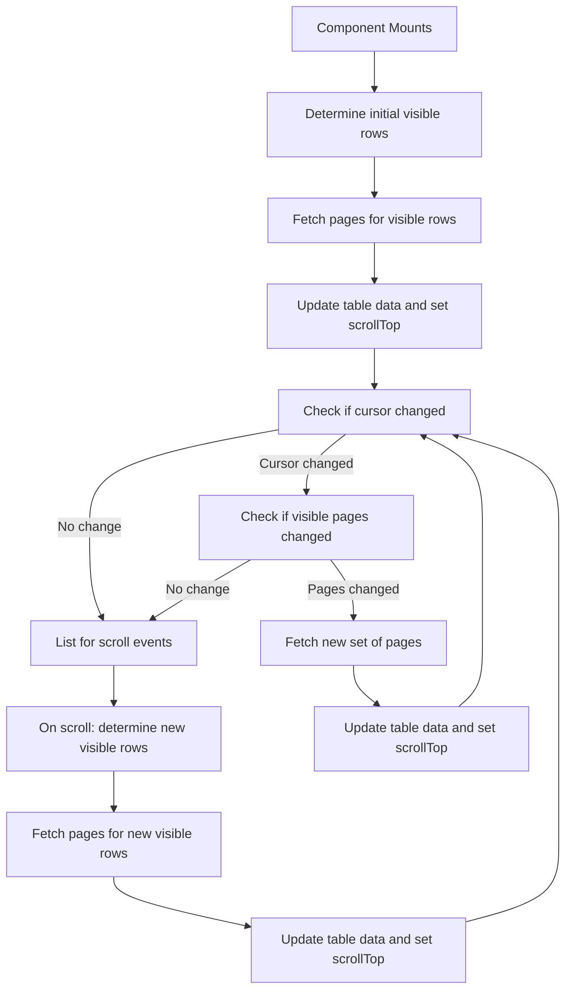
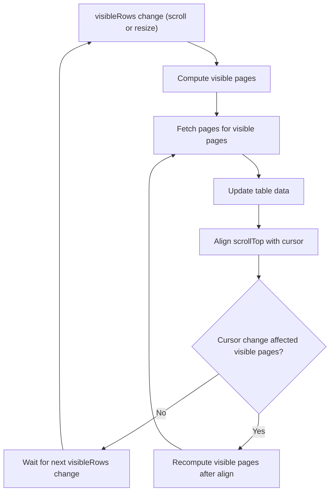

on mount of the component call `table.fetchPages([1])` which calls `paginator.fetchPage(page)` for eaach page + visible pages in table.
Once all pages resolves they are returned back to the `table` which runs cursor validation on
existing visible page against received visible page. If cursor changed we will check if received pages contain all
new visible pages, if not then refetch visible pages against the cursor. We will repeat this process until we have
visible pages against the cursor. once we have them we will set scrollTop based on new cursor and set data in table

UPdated

